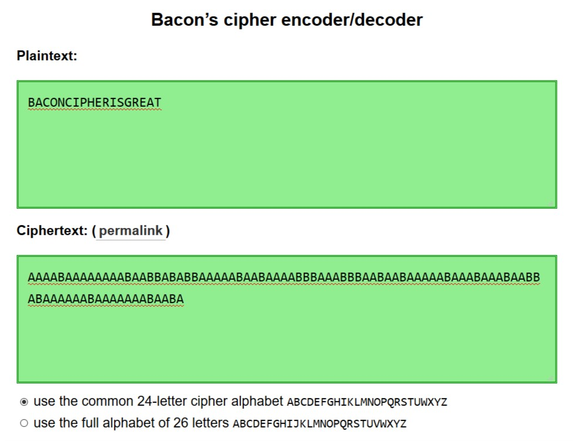
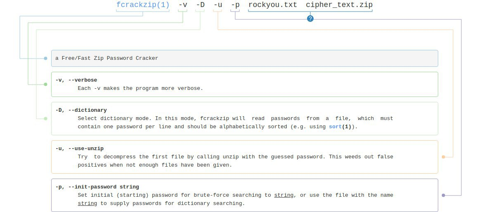
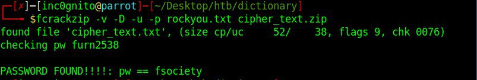
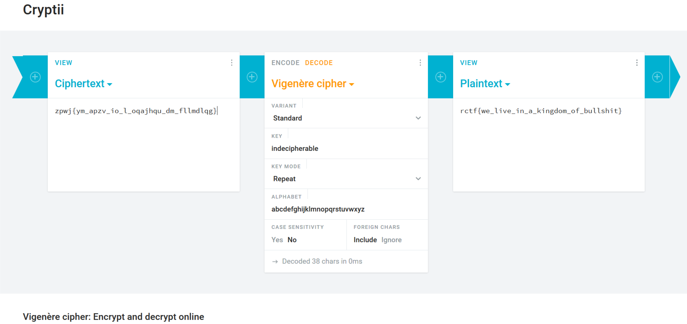
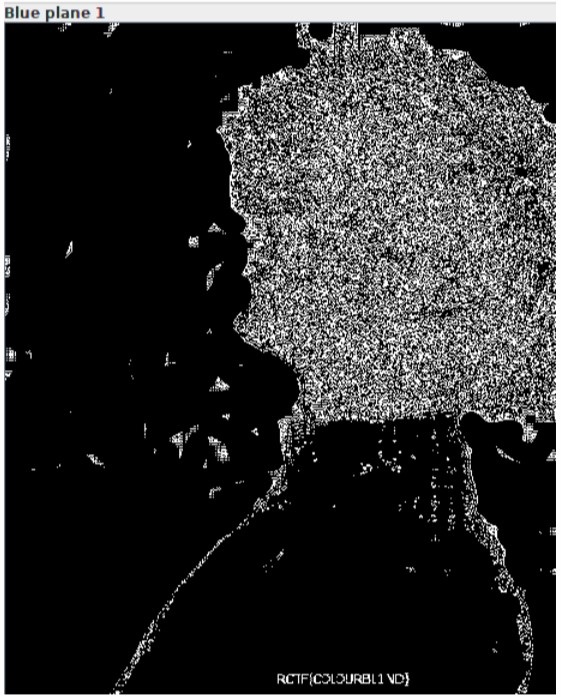

# RCTF_write-ups

`Here lie the write-ups for the challenges presented in Rooters CTF, hosted by Team 1ncogn1to, the CTF team of USICT.`

RCTF was a worldwide Free-for-all competition dedicated to InfoSec and CyberSec Community. It was a Jeopardy type capture the flag competition, held online where participants were presented with questions related to Cryptography, Web Hacking, Forensics, Reverse, Steganography and other various fields of cyber and information security.


## Overview

**URL:** http://www.rootersctf.in/ (still online)<br>
**Organizer:** <a href="http://www.ipu.ac.in/usict">USICT</a><br>
**Duration:** 15 Hrs<br>
**Team:** <a href="https://ctftime.org/team/51783">1ncogn1to</a><br>

```
Title                           Category           Points         Flag
------------------------------- ------------------ -------------- ------------------------------------------------
Old Is Gold                     Crypto             10             RCTF{INFOXPRESSION}
Francis Secret                  Crypto             20             RCTF{BACONCIPHERISGREAT}
Automate or Die!                Crypto             30             RCTF{b@se64_1s_c00l}
Indecipherable                  Crypto             50             rctf{we_live_in_a_kingdom_of_bullshit}
50 Shades of Stegano            Stegano            10             RCTF{C0L0URBL1ND}
M4SS4CR3                        Stegano            50             RCTF{wubba_lubba_dub_dub}
Hide-and-seek                   Stegano            100            RCTF{x0r_is_we1rd}
```


## Crypto 10: Old Is Gold

**Challenge**

Decode this: 444-66-333-666-99-7-777-33-7777-7777-444-666-66<br>
`Put the flag in RCTF{}`

**Solution**

Here, _Old_ refers to the old-fashioned basic cell phones and the given encrypted text contains only repeated decimal numbers. Thus, it seems like the flag is encrypted with an old-fashioned keypad just like it was used to type back then.


444 - I  
66 - N  
333 - F  
666 - O  
99 - X  
7 - P  
777 - R  
33 - E  
7777 - S  
7777 - S  
444 - I  
666 - O  
66 - N  

**Flag**

`RCTF{INFOXPRESSION}`<br>
Note: Flag is case-insensitive.


## Crypto 20: Francis Secret

**Challenge**

`Put the flag in RCTF{}`


**Solution**

The name of the challenge, 'Francis Secret', suggests the use of Francis Cipher. On decoding the encrypted text using the common 24-letter cipher alphabet ABCDEFGHIKLMNOPQRSTUWXYZ, we get the flag.
Decoder: (https://mothereff.in/bacon)



**Flag**

`RCTF{BACONCIPHERISGREAT}`


## Crypto 30: Automate or Die!

**Challenge**

 “Try, try and fail, but never fail to try!”
 [Cipher Text](writeupfiles/cipher.txt)
 
 **Solution**
 
 The given quote suggests _repetition_ and [Cipher Text](writeupfiles/cipher.txt) contains a base64 encoeded value. So maybe it's the repeated base64 encyption.
 
 A simple python script can decode it recursively until the flag is obtained.
 ```
 #!/usr/bin/env python3

import base64

with open("cipher.txt", 'rb') as f:
    flag = f.read()

while True:
    flag = base64.b64decode(flag)
    if flag.decode("utf-8")[0:4] == 'RCTF':
        print(flag)
        exit()
```

**Flag**

`RCTF{b@se64_1s_c00l}`


## Crypto 50: Indecipherable

**Challange**

Sometimes what we are looking for is right in front of us.
[Cipher Text](writeupfiles/cipher_text.zip)

**Solution**

The given [Cipher Text](writeupfiles/cipher_text.zip) is an encrypted zip file which can be cracked by dictionary attack using fcrackzip tool.





On extracting the files from encrypted zip file using password "fsociety", we get a text file with flag like text in it. Also, Vignere Cipher is also known as "the indecipherable cipher", hinting the possibility of vignere encryption. Decrypting it with "Indecipherable" as the key on https://cryptii.com/pipes/vigenere-cipher gives the flag.



**Flag**

`rctf{we_live_in_a_kingdom_of_bullshit}`


## Stegano 10: 50 Shades of Stegano

**Challenge**

You can't see me!
[hidden.png](writeupfiles/hidden.png)

**Solution**

As the challenge name suggests, viewing the given image file ([hidden.png](writeupfiles/hidden.png)) with different filters with the help of '<a href="https://github.com/zardus/ctf-tools/blob/master/stegsolve/install">Stegsolve</a>' tool will make the flag visible. Also, just by focusing hard enough on the bottom side of the image you can see the flag written in a shade of black slightly different then the base one. 

Note: Flag is in leetspeak.

**Flag**

`RCTF{C0L0URBL1ND}`
